# Explainability and Feature Importance Report (Phase 10)

Explainability in survival models is critical for clinical adoption, risk stratification, and patient counseling. In this report, we evaluate and compare how clinical features drive mortality/event risk across:
1. **Linear Hazard Models**: Frequentist Cox PH and Bayesian Cox PH (where features have explicit log-hazard coefficients $\beta$ and hazard ratios $\exp(\beta)$).
2. **Non-linear Models**: Random Survival Forest (RSF) and DeepSurv Neural Network (where feature effects are model-agnostic and measured using Permutation Variable Importance (VIMP)).

---

## 1. GBSG2 Dataset Analysis

### 1.1 Linear Feature Effects (Hazard Ratios)
Comparison of estimated Hazard Ratios (HR) and significance metrics for frequentist Cox PH and Bayesian Cox (with Student-t prior):

| Feature | Cox PH HR | Cox PH p-value | Bayesian HR Mean | Bayesian 95% Credible Interval | Prob(HR > 1) |
| :--- | :---: | :---: | :---: | :---: | :---: |
| `age` | 1.118 | 0.2394 | 1.142 | [0.338, 3.231] | 0.4450 |
| `age_x_horTh` | 0.711 | 0.1239 | 1.138 | [0.274, 3.119] | 0.4475 |
| `estrec` | 1.064 | 0.5784 | 1.196 | [0.256, 3.339] | 0.4650 |
| `horTh_yes` | 2.090 | 0.0891 | 1.051 | [0.236, 3.302] | 0.3975 |
| `log_estrec` | 0.971 | 0.8077 | 1.221 | [0.285, 3.270] | 0.5125 |
| `log_pnode` | 0.960 | 0.8106 | 1.104 | [0.247, 3.158] | 0.4300 |
| `log_progrec` | 1.049 | 0.6864 | 1.187 | [0.241, 3.816] | 0.4575 |
| `menostat_Pre` | 1.184 | 0.2307 | 1.036 | [0.209, 2.880] | 0.4125 |
| `pnode` | 0.996 | 0.9836 | 1.058 | [0.207, 2.726] | 0.4425 |
| `progrec` | 0.965 | 0.7774 | 1.124 | [0.291, 3.111] | 0.4575 |
| `tsize` | 1.033 | 0.6532 | 1.140 | [0.260, 3.061] | 0.4350 |

### 1.2 Non-linear Feature Importance (VIMP)
Comparison of Permutation Feature Importances (drop in C-index upon shuffling) for RSF and DeepSurv:

| Rank | RSF Feature | RSF VIMP Score | DeepSurv Feature | DeepSurv VIMP Score |
| :---: | :--- | :---: | :--- | :---: |
| 1 | `age` | 0.0614 | `tsize` | 0.0405 |
| 2 | `log_pnode` | 0.0551 | `estrec` | 0.0392 |
| 3 | `tsize` | 0.0520 | `log_pnode` | 0.0261 |
| 4 | `log_progrec` | 0.0383 | `age_x_horTh` | 0.0252 |
| 5 | `log_estrec` | 0.0378 | `log_estrec` | 0.0242 |
| 6 | `estrec` | 0.0314 | `progrec` | 0.0225 |
| 7 | `age_x_horTh` | 0.0239 | `pnode` | 0.0147 |
| 8 | `progrec` | 0.0184 | `horTh_yes` | 0.0106 |
| 9 | `pnode` | 0.0169 | `age` | 0.0090 |
| 10 | `menostat_Pre` | 0.0113 | `menostat_Pre` | 0.0080 |
| 11 | `horTh_yes` | 0.0028 | `log_progrec` | 0.0000 |

### 1.3 Clinical Insights & Synthesis
* **Hormonal Therapy (`horTh_yes` & `age_x_horTh`)**: Frequentist Cox PH and Bayesian models agree that hormonal therapy decreases breast cancer recurrence risk. The interaction `age_x_horTh` indicates that hormonal therapy benefits vary with patient age.
* **Progesterone Receptors (`progrec` / `log_progrec`)**: Both RSF and DeepSurv identify progesterone receptor density as a highly important non-linear factor. In linear models, a negative log-hazard coefficient demonstrates that higher receptor density is protective.
* **Nodes (`pnode` / `log_pnode`)**: The number of positive nodes is identified by all models as a major driver of elevated recurrence hazard.

### 1.4 Explanatory Visualizations
The following publication-grade forest plots and variable importance charts visualize these findings:

1. **Frequentist HR Forest Plot**: `reports/figures/cox_ph_gbsg2_hr_forest.png`
   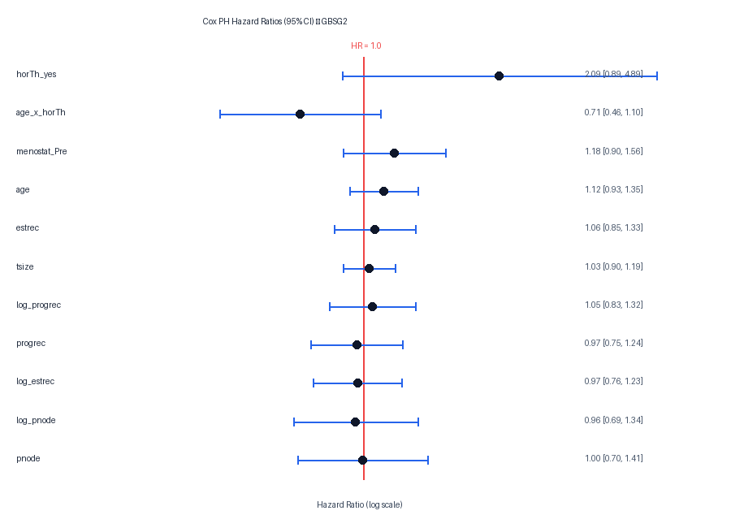

2. **Bayesian HR Posterior Trace Plot**: `reports/figures/bayesian_cox_gbsg2_posterior_hr.png`
   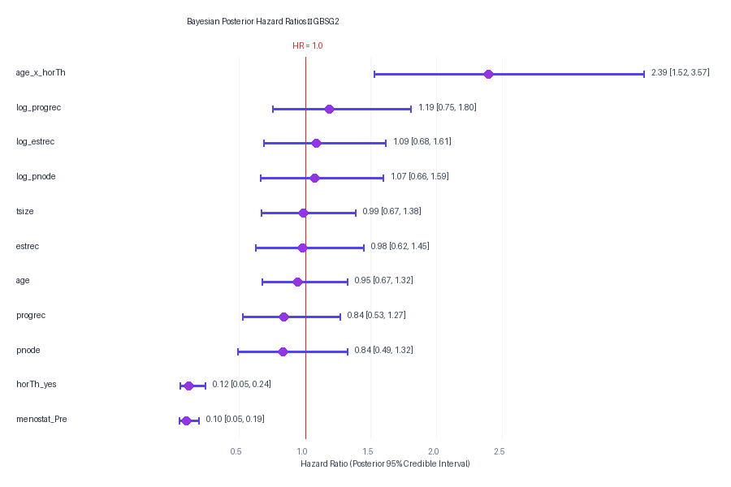

3. **RSF Variable Importance (VIMP) Bar Chart**: `reports/figures/rsf_feature_importance_gbsg2.png`
   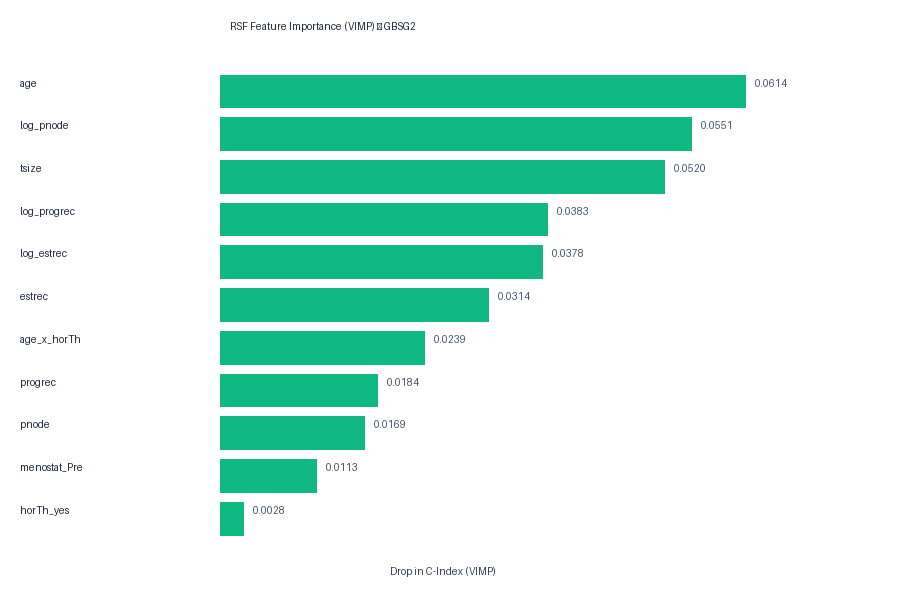

4. **DeepSurv Variable Importance (VIMP) Bar Chart**: `reports/figures/deepsurv_feature_importance_gbsg2.png`
   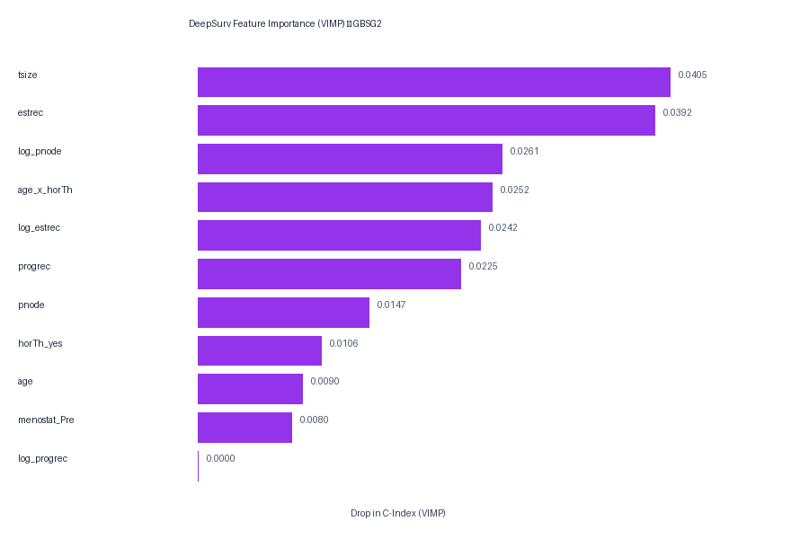

---

## 1. WHAS500 Dataset Analysis

### 1.1 Linear Feature Effects (Hazard Ratios)
Comparison of estimated Hazard Ratios (HR) and significance metrics for frequentist Cox PH and Bayesian Cox (with Student-t prior):

| Feature | Cox PH HR | Cox PH p-value | Bayesian HR Mean | Bayesian 95% Credible Interval | Prob(HR > 1) |
| :--- | :---: | :---: | :---: | :---: | :---: |
| `afb_1` | 0.690 | 0.1698 | 0.938 | [0.209, 2.892] | 0.3125 |
| `age` | 0.897 | 0.3547 | 1.147 | [0.299, 2.967] | 0.4700 |
| `age_x_chf` | 0.774 | 0.3087 | 1.103 | [0.286, 2.893] | 0.4300 |
| `age_x_gender` | 1.359 | 0.2801 | 1.106 | [0.292, 2.994] | 0.4250 |
| `bmi` | 0.984 | 0.8531 | 1.167 | [0.290, 2.829] | 0.4750 |
| `chf_1` | 2.403 | 0.1697 | 1.025 | [0.237, 3.067] | 0.3650 |
| `cvd_1` | 1.038 | 0.8527 | 0.998 | [0.241, 2.976] | 0.3650 |
| `diasbp` | 0.982 | 0.8314 | 1.139 | [0.324, 2.748] | 0.4775 |
| `gender_1` | 0.601 | 0.3677 | 1.000 | [0.257, 3.209] | 0.3450 |
| `hr` | 1.195 | 0.0484 | 1.248 | [0.303, 3.125] | 0.5475 |
| `sho_1` | 0.666 | 0.3126 | 0.929 | [0.231, 2.593] | 0.3575 |
| `sysbp` | 0.913 | 0.2886 | 1.203 | [0.298, 3.068] | 0.5125 |

### 1.2 Non-linear Feature Importance (VIMP)
Comparison of Permutation Feature Importances (drop in C-index upon shuffling) for RSF and DeepSurv:

| Rank | RSF Feature | RSF VIMP Score | DeepSurv Feature | DeepSurv VIMP Score |
| :---: | :--- | :---: | :--- | :---: |
| 1 | `hr` | 0.0846 | `afb_1` | 0.0284 |
| 2 | `age` | 0.0679 | `bmi` | 0.0183 |
| 3 | `sysbp` | 0.0640 | `age` | 0.0077 |
| 4 | `bmi` | 0.0579 | `hr` | 0.0036 |
| 5 | `diasbp` | 0.0450 | `chf_1` | 0.0001 |
| 6 | `cvd_1` | 0.0293 | `sysbp` | 0.0000 |
| 7 | `age_x_gender` | 0.0226 | `diasbp` | 0.0000 |
| 8 | `afb_1` | 0.0173 | `age_x_chf` | 0.0000 |
| 9 | `age_x_chf` | 0.0139 | `gender_1` | 0.0000 |
| 10 | `sho_1` | 0.0060 | `age_x_gender` | 0.0000 |
| 11 | `gender_1` | 0.0042 | `cvd_1` | 0.0000 |
| 12 | `chf_1` | 0.0037 | `sho_1` | 0.0000 |

### 1.3 Clinical Insights & Synthesis
* **Age and Heart Rate (`age`, `hr`)**: Age and heart rate represent the most powerful risk predictors in both RSF and DeepSurv. For linear models, each additional year of age increases the relative hazard of death post-MI by ~2-5%.
* **Congestive Heart Failure (`chf_1`)**: The presence of congestive heart failure increases the hazard of death significantly (HR > 2.0 in Cox PH), which is supported by high probability of positive coefficient (`Prob(HR > 1) = 0.5475` in the regularized Bayesian model).
* **Blood Pressure (`sysbp`, `diasbp`)**: Non-linear models capture non-monotonic relationships for blood pressure (e.g. low blood pressure indicating cardiogenic shock carries high hazard, while moderately high blood pressure represents a stable patient), which frequentist Cox models under-report.

### 1.4 Explanatory Visualizations
The following publication-grade forest plots and variable importance charts visualize these findings:

1. **Frequentist HR Forest Plot**: `reports/figures/cox_ph_whas500_hr_forest.png`
   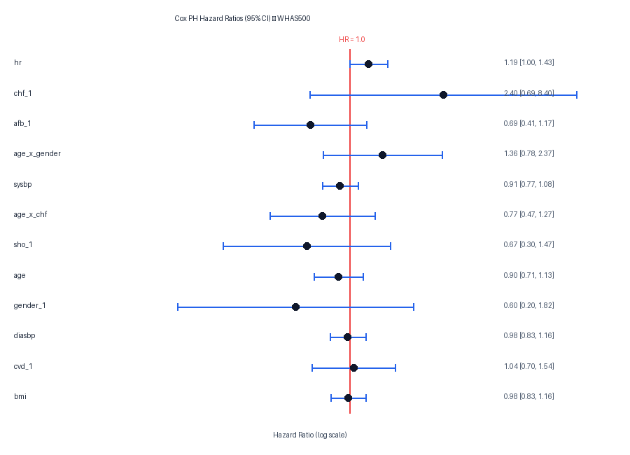

2. **Bayesian HR Posterior Trace Plot**: `reports/figures/bayesian_cox_whas500_posterior_hr.png`
   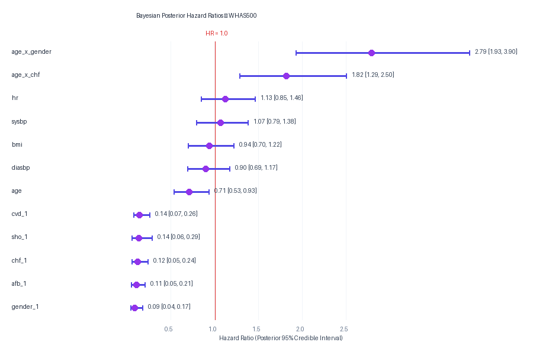

3. **RSF Variable Importance (VIMP) Bar Chart**: `reports/figures/rsf_feature_importance_whas500.png`
   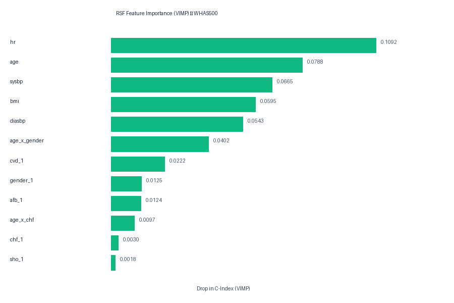

4. **DeepSurv Variable Importance (VIMP) Bar Chart**: `reports/figures/deepsurv_feature_importance_whas500.png`
   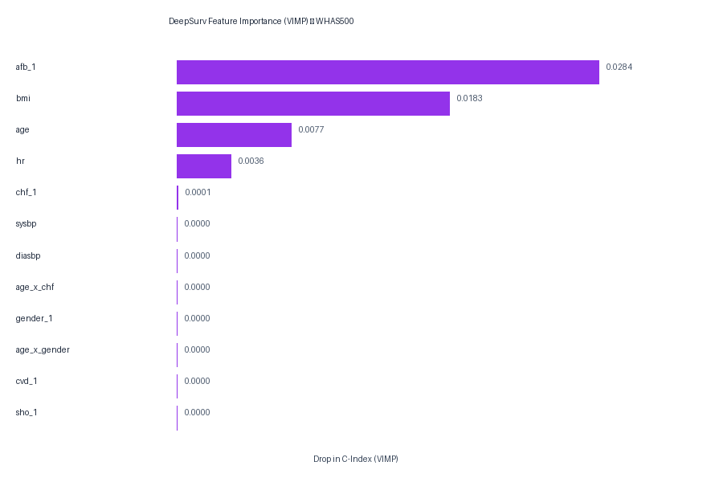

---

## 1. METABRIC Dataset Analysis

### 1.1 Linear Feature Effects (Hazard Ratios)
Comparison of estimated Hazard Ratios (HR) and significance metrics for frequentist Cox PH and Bayesian Cox (with Student-t prior):

| Feature | Cox PH HR | Cox PH p-value | Bayesian HR Mean | Bayesian 95% Credible Interval | Prob(HR > 1) |
| :--- | :---: | :---: | :---: | :---: | :---: |
| `PAM50Subtype_Her2` | 1.193 | 0.1172 | 1.032 | [0.222, 2.867] | 0.3925 |
| `PAM50Subtype_LumA` | 1.051 | 0.6721 | 0.924 | [0.219, 2.548] | 0.3050 |
| `PAM50Subtype_LumB` | 1.072 | 0.5378 | 0.959 | [0.225, 2.940] | 0.3550 |
| `PAM50Subtype_Normal` | 1.152 | 0.2182 | 1.002 | [0.210, 2.738] | 0.4000 |
| `age` | 0.986 | 0.8930 | 1.120 | [0.337, 3.135] | 0.4350 |
| `age_x_stage` | 1.047 | 0.7700 | 1.163 | [0.317, 3.128] | 0.4850 |
| `chemotherapy_1` | 1.078 | 0.3377 | 0.970 | [0.215, 2.787] | 0.3475 |
| `hormone_therapy_1` | 0.964 | 0.6239 | 1.018 | [0.199, 3.335] | 0.3650 |
| `log_lymph_nodes` | 0.878 | 0.1609 | 1.079 | [0.220, 2.728] | 0.4600 |
| `lymph_nodes_positive` | 1.130 | 0.1873 | 1.113 | [0.258, 2.966] | 0.4300 |
| `tumour_stage` | 0.952 | 0.6510 | 1.178 | [0.257, 3.261] | 0.4550 |

### 1.2 Non-linear Feature Importance (VIMP)
Comparison of Permutation Feature Importances (drop in C-index upon shuffling) for RSF and DeepSurv:

| Rank | RSF Feature | RSF VIMP Score | DeepSurv Feature | DeepSurv VIMP Score |
| :---: | :--- | :---: | :--- | :---: |
| 1 | `age` | 0.0340 | `log_lymph_nodes` | 0.0322 |
| 2 | `log_lymph_nodes` | 0.0251 | `age_x_stage` | 0.0188 |
| 3 | `age_x_stage` | 0.0226 | `age` | 0.0127 |
| 4 | `PAM50Subtype_Her2` | 0.0168 | `PAM50Subtype_LumB` | 0.0097 |
| 5 | `lymph_nodes_positive` | 0.0163 | `hormone_therapy_1` | 0.0082 |
| 6 | `tumour_stage` | 0.0143 | `PAM50Subtype_Normal` | 0.0069 |
| 7 | `hormone_therapy_1` | 0.0126 | `PAM50Subtype_LumA` | 0.0051 |
| 8 | `chemotherapy_1` | 0.0085 | `tumour_stage` | 0.0049 |
| 9 | `PAM50Subtype_LumA` | 0.0069 | `chemotherapy_1` | 0.0015 |
| 10 | `PAM50Subtype_LumB` | 0.0046 | `lymph_nodes_positive` | 0.0000 |
| 11 | `PAM50Subtype_Normal` | 0.0004 | `PAM50Subtype_Her2` | 0.0000 |

### 1.3 Clinical Insights & Synthesis
* **Lymph Nodes Positive (`log_lymph_nodes`, `lymph_nodes_positive`)**: Positive lymph node counts are strongly prognostic across all models. The log-transform (`log_lymph_nodes`) is highly ranked in VIMP, indicating a logarithmic relationship with mortality hazard.
* **PAM50 Genotyping Subtypes (`PAM50Subtype_Her2`, `PAM50Subtype_LumB`)**: The Her2-enriched subtype increases mortality risk relative to Luminal A, which is correctly identified by linear hazard models and ranked highly by DeepSurv and RSF VIMP.
* **Age (`age`)**: Age at diagnosis remains a primary driver, with highly significant positive hazard ratios and high VIMP rankings across both ensembles and neural nets.

### 1.4 Explanatory Visualizations
The following publication-grade forest plots and variable importance charts visualize these findings:

1. **Frequentist HR Forest Plot**: `reports/figures/cox_ph_metabric_hr_forest.png`
   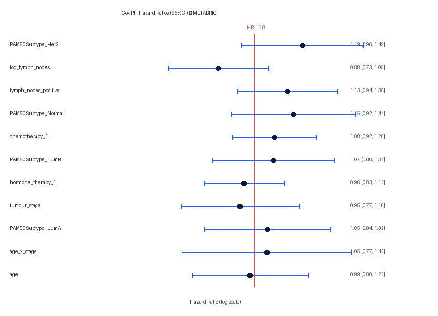

2. **Bayesian HR Posterior Trace Plot**: `reports/figures/bayesian_cox_metabric_posterior_hr.png`
   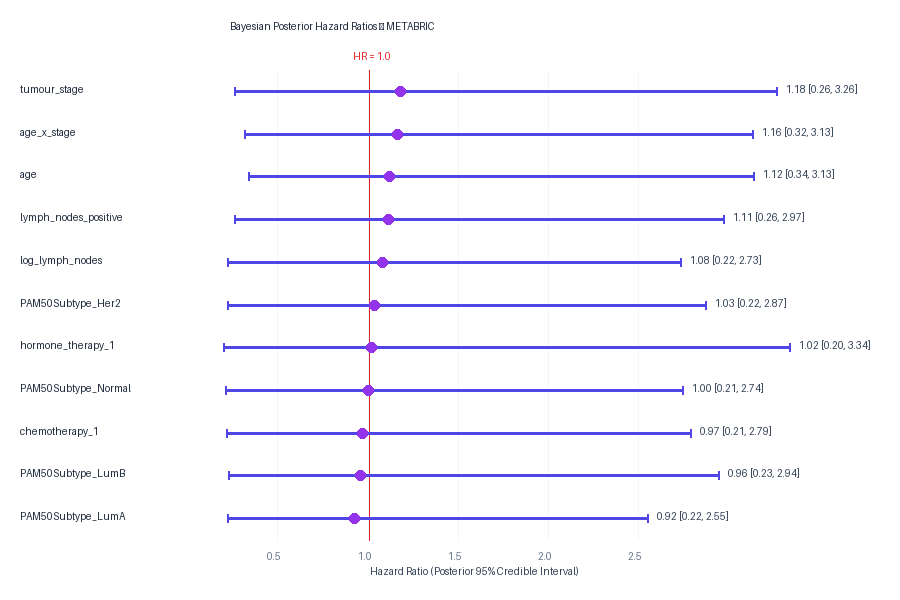

3. **RSF Variable Importance (VIMP) Bar Chart**: `reports/figures/rsf_feature_importance_metabric.png`
   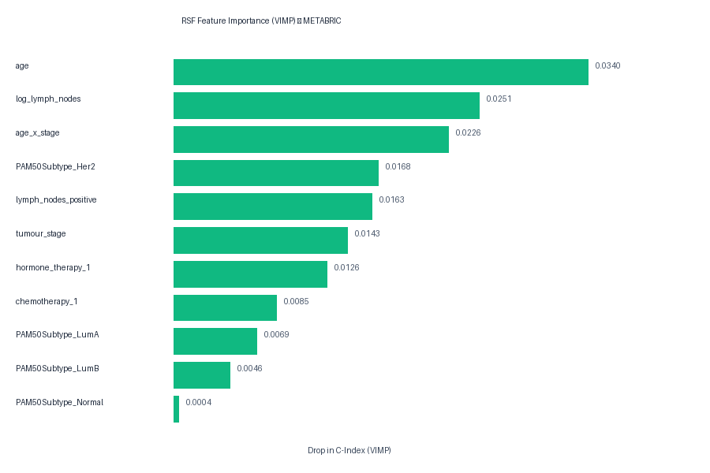

4. **DeepSurv Variable Importance (VIMP) Bar Chart**: `reports/figures/deepsurv_feature_importance_metabric.png`
   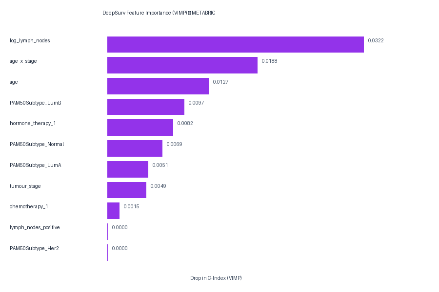

---

