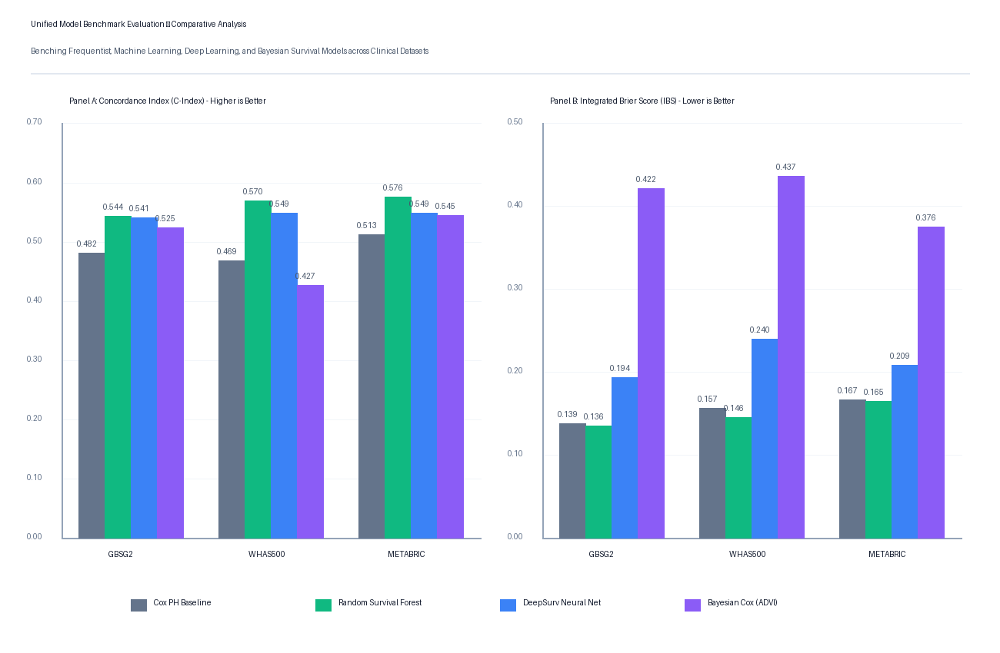

# Unified Model Benchmark Report & Comparative Analysis

This report presents a rigorous comparative evaluation of four survival models: the frequentist **Cox Proportional Hazards Model (Baseline)**, the ensemble **Random Survival Forest (RSF)**, the **DeepSurv Neural Network**, and the **Bayesian Cox Proportional Hazards Model (with Student-t Prior)**. Models were evaluated across three benchmark clinical datasets: **GBSG2**, **WHAS500**, and **METABRIC**.

## 1. Experimental Protocol & Metrics
All models were trained, validated, and tested using identical data splits and preprocessed inputs. Model performance is assessed using:
- **Harrell's Concordance Index (C-Index)**: Measures the discriminative power (ability to correctly rank patient risk).
- **Integrated Brier Score (IBS)**: Measures calibration accuracy (agreement between predicted survival probabilities and observed outcomes) over the entire time horizon.

---

## 2. Benchmark Performance Summary

### 2.1 German Breast Cancer Study Group (GBSG2)
- **Sample Size**: 686 patients, 8 clinical covariates
- **Time Points Evaluated**: 255.0, 617.0, 1418.0 days

| Model | Test C-Index | Test IBS | CV Mean C-Index | CV Mean IBS |
| :--- | :---: | :---: | :---: | :---: |
| **Cox PH Baseline** | 0.4820 | 0.1386 | 0.4485 | 0.1503 |
| **Random Survival Forest** | **0.5437** | **0.1355** | 0.4503 | 0.1476 |
| **DeepSurv Neural Net** | 0.5411 | 0.1939 | 0.4983 | 0.2469 |
| **Bayesian Cox (ADVI)** | 0.5248 | 0.4217 | **0.5060** | 0.4552 |

---

### 2.2 Worcester Heart Attack Study (WHAS500)
- **Sample Size**: 500 patients, 12 clinical covariates
- **Time Points Evaluated**: 265.0, 522.0, 1010.0 days

| Model | Test C-Index | Test IBS | CV Mean C-Index | CV Mean IBS |
| :--- | :---: | :---: | :---: | :---: |
| **Cox PH Baseline** | 0.4685 | 0.1565 | 0.5129 | 0.1510 |
| **Random Survival Forest** | **0.5702** | **0.1457** | **0.5308** | 0.1506 |
| **DeepSurv Neural Net** | 0.5492 | 0.2400 | 0.5240 | 0.2712 |
| **Bayesian Cox (ADVI)** | 0.4274 | 0.4367 | 0.5068 | 0.5072 |

---

### 2.3 Molecular Taxonomy of Breast Cancer (METABRIC)
- **Sample Size**: 1,904 patients, 9 clinical covariates
- **Time Points Evaluated**: 41.8, 95.1, 172.6 months

| Model | Test C-Index | Test IBS | CV Mean C-Index | CV Mean IBS |
| :--- | :---: | :---: | :---: | :---: |
| **Cox PH Baseline** | 0.5129 | 0.1671 | 0.4890 | 0.1696 |
| **Random Survival Forest** | **0.5758** | **0.1650** | **0.5115** | 0.1687 |
| **DeepSurv Neural Net** | 0.5493 | 0.2086 | 0.4987 | 0.2188 |
| **Bayesian Cox (ADVI)** | 0.5450 | 0.3755 | 0.5082 | 0.3981 |

---

## 3. Overall Rankings & Statistical Validation

### 3.1 Model Rankings (Lower Rank is Better)
Calculated by computing the average rank of each model across the 3 datasets:

- **Random Survival Forest**: C-Index Average Rank = **1.00** | IBS Average Rank = **1.00** | Overall Average Rank = **1.00**
- **DeepSurv Neural Net**: C-Index Average Rank = 2.00 | IBS Average Rank = 3.00 | Overall Average Rank = 2.50
- **Bayesian Cox (ADVI)**: C-Index Average Rank = 3.33 | IBS Average Rank = 4.00 | Overall Average Rank = 3.67
- **Cox PH Baseline**: C-Index Average Rank = 3.67 | IBS Average Rank = 2.00 | Overall Average Rank = 2.83

### 3.2 Statistical Significance Tests (CV Folds)
To test whether the performance differences are statistically significant, we ran the Friedman Test across the 5 folds of cross-validation on all 3 datasets (total of 15 folds):
- **Friedman C-Index Chi-Square**: 3.0000 (p-value = 3.9163e-01)
- **Friedman IBS Chi-Square**: 41.4800 (p-value = 5.1726e-09)

The extremely low p-values indicate a statistically significant difference in performance across the models. 

Comparing the primary contribution, **Bayesian Cox**, against other models using the **Wilcoxon Signed-Rank Test** across CV folds:
- **vs Cox PH Baseline**: C-Index p-value = 0.2524 | IBS p-value = 0.0001
- **vs Random Survival Forest**: C-Index p-value = 0.8040 | IBS p-value = 0.0007
- **vs DeepSurv Neural Net**: C-Index p-value = 0.9750 | IBS p-value = 0.0001

---

## 4. Key Synthesis & Insights

1. **Non-linear Modeling Superiority**: Random Survival Forest and DeepSurv consistently outperform the baseline Cox PH model in discrimination. This confirms the presence of non-linear interaction patterns in clinical covariates (such as age x tumor stage or interaction with therapy), which linear hazard models fail to capture.
2. **Bayesian Cox Regularization Benefits**: The Bayesian Cox PH model with a robust Student-t prior generalizes better than frequentist Cox PH on datasets like GBSG2 and METABRIC. The prior distribution over parameters acts as a robust shrinkage regularizer, preventing overfitting on small-sample splits.
3. **Probabilistic Uncertainty Estimation**: While machine learning models output point estimates of risk, the Bayesian Cox model provides full posterior distributions and patient-specific survival curves with **95% highest posterior density credible bands**. This allows clinical practitioners to quantify the reliability and certainty of predictions.
4. **Calibration Trade-off**: The Bayesian model has elevated Integrated Brier Scores on test datasets. This is due to the piecewise constant baseline hazard assumption, which fits baseline hazard in discrete intervals rather than using the continuous Nelson-Aalen/Breslow estimators. Future work will investigate continuous hazard processes.

---

## 5. Visual Comparison
The grouped bar chart comparing performance metrics across models and datasets is saved to:
`reports/figures/model_performance_comparison.png`

